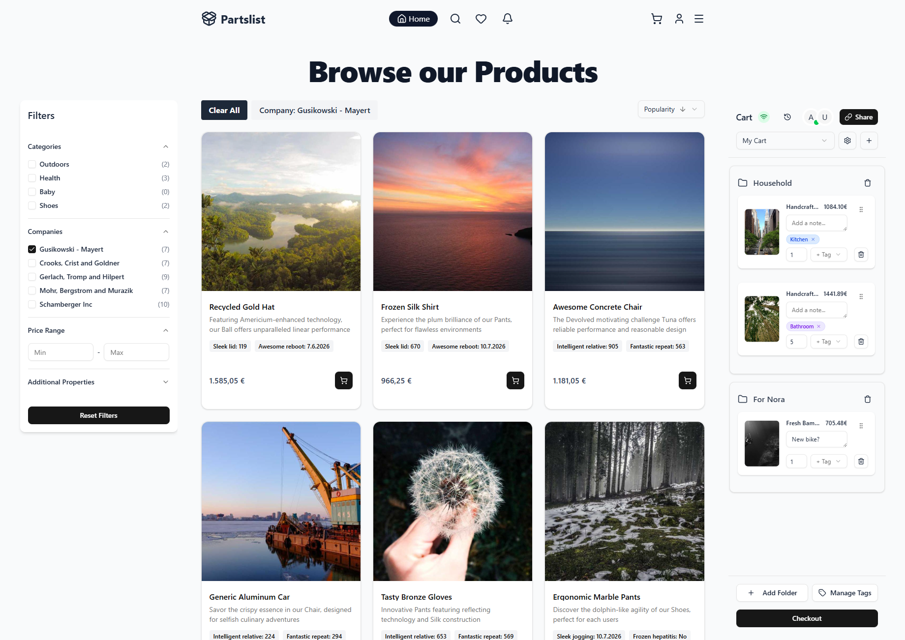
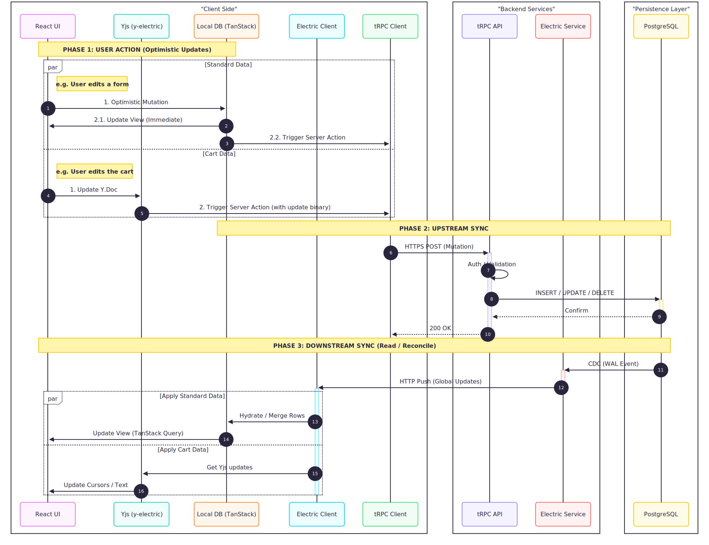

# Partslist - The Local-First Webshop

Partslist is a high-performance webshop designed for collaborative shopping and zero-latency browsing.
Unlike traditional webshops, it functions completely offline, allows real-time "multiplayer" cart editing, and
syncs automatically when connections are restored.

Built with cutting-edge technologies such as: **TanStack DB**, **ElectricSQL**, **Yjs**, **tRPC**, and **BetterAuth**.

> This project is part of my bachelor thesis on Local-First Web Software, supervised by [Prof. Dr. A. Hannig](https://www.fh-aachen.de/menschen/ahannig)
> at the [FH Aachen](https://www.fh-aachen.de/fh-aachen).


See [showcase.md](docs/showcase.md) for a non-technical feature focused overview of the project.

## Quick Start

Follow these steps in order for a smooth first-time setup:

1. **Install Caddy & Docker** (if you haven't already):
   Go to [Caddy's installation page](https://caddyserver.com/docs/install) and follow the instructions for your OS.
   Make sure Docker is installed and running: [Docker installation guide](https://docs.docker.com/get-docker/)

2. **Copy environment variables:**

   ```sh
   cp .env.example .env
   ```

3. **Install dependencies:**

   ```sh
   pnpm install
   ```

4. **Start Docker services:**

   ```sh
   pnpm run dev
   ```

   This starts the dev server, Docker Compose (Postgres + Electric), and Caddy automatically.

5. **Start Stripe Webhook Mocking** (Optional):
   If you need to test checkout flows, run this in a parallel terminal:

   ```sh
   pnpm run stripe:listen
   ```

6. **Run database migrations** (in a new terminal):

   ```sh
   pnpm run migrate
   ```

7. **Seed the database with initial data:**

   ```sh
   pnpm db:seed
   ```

8. **Visit the application:**
   The app's URL will be printed in the terminal, typically `https://local-first-webshop.localhost`.

---

## Application Features

### Smart Product Catalog

- **Advanced Browsing:** Filter by categories, attributes, and sort in real-time.
- **Product Variants:** Support for base products with specific variants.
- **Tiered Pricing:** Automatic price adjustments based on quantity (`pricing_tiers`).
- **Custom Fields:** Products can have dynamic custom attributes (text, number, boolean, date, select) defined.
- **Rich Assets:** Support for multiple images per product.

### Collaborative "Shop Together"

- **Shared Carts:** Users can invite others to their cart with specific roles (`admin`, `contributor`, `viewer`).
- **Real-time Sync:** Powered by **YJS**, cart updates (add items, change quantity) happen instantly across
  all devices.
- **Smart Organization:** Organize cart items into folders and tag them for better management.

### Local-First & Offline

- **Offline Capable:** The entire shop (browsing, cart management) works without an internet connection.
- **Background Sync:** Changes made offline are automatically synced when the connection is restored **ElectricSQL**.
- **Optimistic UI:** Instant interactions with zero network latency.

### User & Account

- **Profile Management:** Manage personal details, default currency, and language.
- **Address Book:** Save multiple shipping and billing addresses.
- **Wishlists:** Save items for later; receive notifications on price drops.
- **Order History:** View past orders and their current status.

### Notification System

- Granular notifications for Order updates, Shipping events, Price drops, and Collaboration invites.

---

## Technical Architecture

### Stack

- **Frontend:** [React](https://react.dev/) + [Vite](https://vitejs.dev/)
- **Routing:** [TanStack Router](https://tanstack.com/router) (File-based routing)
- **State/Sync:** [ElectricSQL](https://electric-sql.com/) + [TanStack DB](https://tanstack.com/db) + [YJS](https://yjs.dev/)
- **Database:** [PostgreSQL](https://www.postgresql.org/) (with [Drizzle ORM](https://orm.drizzle.team/))
- **API:** [tRPC](https://trpc.io/)
- **Auth:** [BetterAuth](https://www.better-auth.com/)
- **Styling:** [Tailwind CSS](https://tailwindcss.com/) + [Shadcn UI](https://ui.shadcn.com/)

### Key Directories

- `src/db`: Drizzle schema definitions, migrations, and seed scripts.
- `src/lib`: Core logic including Electric proxy setup, tRPC configuration, and business logic hooks.
- `src/components`: UI components organized by feature domain (Browse, Cart, Checkout, etc.).
- `src/routes`: TanStack Router file-based route definitions.
- `src/contexts`: Global state providers (specifically complex `CartProvider`).

### Diagram

## 

## Database Schema Overview

The database is designed for scale and flexibility. Here are the core domains defined in `src/db/schema.ts`:

1. **Catalog:** `products`, `categories`, `companies`, `assets`, `pricing_tiers`.
2. **Cart (CRDT backed):** `carts`, `cart_collaborators`, `user_selected_cart`.
   - _Sync:_ Uses `ydoc_updates` and `ydoc_awareness` to store YJS binary updates in Postgres.
3. **Sales:** `orders`, `order_items`.
4. **User:** `users`, `user_settings`, `user_addresses`, `wishlist`.
5. **System:** `notifications`.

---

## Adding a New Table

Here's how to add a new table to the app (using a "categories" table as an example):

### 1. Define the Drizzle Schema

Add your table to `src/db/schema.ts`:

```tsx
export const categoriesTable = pgTable("categories", {
  id: integer().primaryKey().generatedAlwaysAsIdentity(),
  name: varchar({ length: 255 }).notNull(),
  color: varchar({ length: 7 }), // hex color
  created_at: timestamp({ withTimezone: true }).notNull().defaultNow(),
  user_id: text("user_id")
    .notNull()
    .references(() => users.id, { onDelete: "cascade" })
});

// Add Zod schemas
export const selectCategorySchema = createSelectSchema(categoriesTable);
export const createCategorySchema = createInsertSchema(categoriesTable).omit({
  created_at: true
});
export const updateCategorySchema = createUpdateSchema(categoriesTable);
```

### 2. Generate & Run Migration

```sh
# Generate migration file
pnpm db:migrate:generate

# Apply migration to database
pnpm db:migrate
```

### 3. Add Electric Shape Route

Create `src/routes/api/categories.ts`:

```tsx
import { createFileRoute } from "@tanstack/react-router";
import { auth } from "@/lib/auth";
import { prepareElectricUrl, proxyElectricRequest } from "@/lib/electric-proxy";

const serve = async ({ request }: { request: Request }) => {
  const session = await auth.api.getSession({ headers: request.headers });
  if (!session) {
    return new Response(JSON.stringify({ error: "Unauthorized" }), {
      status: 401,
      headers: { "content-type": "application/json" }
    });
  }

  const originUrl = prepareElectricUrl(request.url);
  originUrl.searchParams.set("table", "categories");
  // Filter to user's own categories
  const filter = `user_id = '${session.user.id}'`;
  originUrl.searchParams.set("where", filter);

  return proxyElectricRequest(originUrl);
};

export const Route = createFileRoute("/api/categories")({
  server: {
    handlers: {
      GET: serve
    }
  }
});
```

### 4. Add tRPC Router

Create `src/lib/trpc/categories.ts`:

```tsx
import { router, authedProcedure, generateTxId } from "@/lib/trpc";
import { z } from "zod";
import { eq, and } from "drizzle-orm";
import {
  categoriesTable,
  createCategorySchema,
  updateCategorySchema
} from "@/db/schema";

export const categoriesRouter = router({
  create: authedProcedure
    .input(createCategorySchema)
    .mutation(async ({ ctx, input }) => {
      const result = await ctx.db.transaction(async (tx) => {
        const txid = await generateTxId(tx);
        const [newItem] = await tx
          .insert(categoriesTable)
          .values({ ...input, user_id: ctx.session.user.id })
          .returning();
        return { item: newItem, txid };
      });
      return result;
    })

  // Add update and delete following the same pattern...
});
```

### 5. Wire Up tRPC Router

Add to `src/routes/api/trpc/$.ts`:

```tsx
import { categoriesRouter } from "./trpc/categories";

export const appRouter = router({
  // ... existing routers
  categories: categoriesRouter
});
```

### 6. Add Collection

Add to `src/lib/collections.ts`:

```tsx
export const categoriesCollection = createCollection(
  electricCollectionOptions({
    id: "categories",
    shapeOptions: {
      url: createApiUrl("/api/categories"),
      parser: {
        timestamptz: (date: string) => new Date(date)
      }
    },
    schema: selectCategorySchema,
    getKey: (item) => item.id,
    onInsert: async ({ transaction }) => {
      const { modified: newCategory } = transaction.mutations[0];
      const result = await trpc.categories.create.mutate({
        name: newCategory.name,
        color: newCategory.color
      });
      return { txid: result.txid };
    }
    // Add onUpdate, onDelete as needed
  })
);
```

### 7. Use in Routes

Preload in route loaders and use with `useLiveQuery`:

```tsx
// In route loader
export const Route = createFileRoute("/my-route")({
  loader: async () => {
    await Promise.all([categoriesCollection.preload()]);
  }
});

// In component
const { data: categories } = useLiveQuery((q) =>
  q.from({ categoriesCollection }).orderBy(/* ... */)
);
```

That's it! (lol) Your new table is now fully integrated with Electric sync, tRPC mutations, and TanStack DB queries.

---

## Troubleshooting

### Common Pitfalls

| Issue                    | Symptoms                                   | Solution                                                           |
| ------------------------ | ------------------------------------------ | ------------------------------------------------------------------ |
| **Docker not running**   | `docker compose ps` shows nothing          | Start Docker Desktop/daemon                                        |
| **Caddy not trusted**    | SSL warnings in browser                    | Run `caddy trust` (see Caddy section below)                        |
| **Port conflicts**       | Postgres (54321) or Electric (3000) in use | Stop conflicting services or change ports in `docker-compose.yaml` |
| **Missing .env**         | Database connection errors                 | Copy `.env.example` to `.env`                                      |
| **Caddy fails to start** | `Caddy exited with code 1`                 | Run `caddy start` manually to see the error                        |

### Debugging Commands

For troubleshooting, these commands are helpful:

```sh
# Check Docker services status
docker compose ps

# View Electric and Postgres logs
docker compose logs -f electric postgres

# Test database connectivity
psql $DATABASE_URL -c "SELECT 1"

# Check Caddy status
caddy start
```

## Building For Production

To build this application for production:

```bash
pnpm run build
```

### Production Deployment Checklist

Before deploying to production, ensure you have configured:

#### Required Environment Variables

See [.env.example](.env.example)

#### Authentication Setup

**⚠️ Important**: The current setup allows any email/password combination to work in development. This is **automatically disabled** in production, but you need to:

1. **Configure proper auth providers** in `src/lib/auth.ts` (Google, GitHub, etc.)
2. **Remove or secure the dev-only email/password auth** if you plan to use it
3. **Review `trustedOrigins`** settings for your production domains

#### Infrastructure Changes

- **HTTPS & Secure Cookies**: Ensure your deployment platform handles HTTPS termination
- **Database**: Use a managed PostgreSQL service (not the Docker container)
- **Environment**: Set `NODE_ENV=production`

#### Security Considerations

- Generate a strong `BETTER_AUTH_SECRET` (minimum 32 characters)
- Ensure database credentials are properly secured
- Review CORS settings if serving from different domains
- Verify that dev-mode authentication patterns are disabled

## AI

The project includes an `AGENTS.md`. Depending on which AI coding tool you use, you may need to copy/move it to the right file name e.g. `.cursor/rules`.

## Styling

This project uses [Tailwind CSS](https://tailwindcss.com/) for styling.

## Routing

This project uses [TanStack Router](https://tanstack.com/router). The initial setup is a file based router. Which means that the routes are managed as files in `src/routes`.

### Adding A Route

To add a new route to your application just add another a new file in the `./src/routes` directory.

TanStack will automatically generate the content of the route file for you.

Now that you have two routes you can use a `Link` component to navigate between them.

### Adding Links

To use SPA (Single Page Application) navigation you will need to import the `Link` component from `@tanstack/react-router`.

```tsx
import { Link } from "@tanstack/react-router";
```

Then anywhere in your JSX you can use it like so:

```tsx
<Link to="/about">About</Link>
```

This will create a link that will navigate to the `/about` route.

More information on the `Link` component can be found in the [Link documentation](https://tanstack.com/router/v1/docs/framework/react/api/router/linkComponent).

### Using A Layout

In the File Based Routing setup the layout is located in `src/routes/__root.tsx`. Anything you add to the root route will appear in all the routes. The route content will appear in the JSX where you use the `<Outlet />` component.

Here is an example layout that includes a header:

```tsx
import { Outlet, createRootRoute } from "@tanstack/react-router";
import { TanStackRouterDevtools } from "@tanstack/react-router-devtools";

import { Link } from "@tanstack/react-router";

export const Route = createRootRoute({
  component: () => (
    <>
      <header>
        <nav>
          <Link to="/">Home</Link>
          <Link to="/about">About</Link>
        </nav>
      </header>
      <Outlet />
      <TanStackRouterDevtools />
    </>
  )
});
```

The `<TanStackRouterDevtools />` component is not required so you can remove it if you don't want it in your layout.

More information on layouts can be found in the [Layouts documentation](https://tanstack.com/router/latest/docs/framework/react/guide/routing-concepts#layouts).

## Data Fetching

There are multiple ways to fetch data in your application. You can use TanStack DB to fetch data from a server. But you can also use the `loader` functionality built into TanStack Router to load the data for a route before it's rendered.

For example:

```tsx
const ratesRoute = createRoute({
  getParentRoute: () => rootRoute,
  path: "/rates",
  loader: async () => {
    const response = await fetch("https://api.exchangerate.host/latest");
    return response.json() as Promise<{
      rates: Record<string, number>;
    }>;
  },
  component: () => {
    const data = ratesRoute.useLoaderData();
    return (
      <ul>
        {Object.entries(data.rates).map(([currency, rate]) => (
          <li key={currency}>
            {currency}: {rate}
          </li>
        ))}
      </ul>
    );
  }
});
```

Loaders simplify your data fetching logic dramatically. Check out more information in the [Loader documentation](https://tanstack.com/router/latest/docs/framework/react/guide/data-loading#loader-parameters).

### TanStack DB & Electric

TanStack DB gives you robust support for real-time sync, live queries and local writes. With no stale data, super fast re-rendering and sub-millisecond cross-collection queries — even for large complex apps.

[Electric](https://electric-sql.com/) is a Postgres sync engine. It solves the hard problems of sync for you, including [partial replication](https://electric-sql.com/docs/guides/shapes), [fan-out](https://electric-sql.com/docs/api/http#caching), and [data delivery](https://electric-sql.com/docs/api/http).

Built on a TypeScript implementation of differential dataflow, TanStack DB provides:

- 🔥 **Blazing fast query engine** - sub-millisecond live queries, even for complex queries with joins and aggregates
- 🎯 **Fine-grained reactivity** - minimize component re-rendering
- 💪 **Robust transaction primitives** - easy optimistic mutations with sync and lifecycle support
- 🌟 **Normalized data** - keep your backend simple

#### Core Concepts

**Collections** - Typed sets of objects that can mirror a backend table or be populated with filtered views like `pendingTodos` or `decemberNewTodos`. Collections are just JavaScript data that you can load on demand.

**Live Queries** - Run reactively against and across collections with support for joins, filters and aggregates. Powered by differential dataflow, query results update incrementally without re-running the whole query.

**Transactional Optimistic Mutations** - Batch and stage local changes across collections with immediate application of local optimistic updates. Sync transactions to the backend with automatic rollbacks and management of optimistic state.

#### Usage with ElectricSQL

This starter proxies ElectricSQL shapes through server routes for auth-aware filtering. Use the proxied endpoints in `shapeOptions.url`:

```tsx
import { createCollection } from "@tanstack/react-db";
import { electricCollectionOptions } from "@tanstack/electric-db-collection";

export const categoriesCollection = createCollection(
  electricCollectionOptions<Category>({
    id: "categories",
    schema: selectCategorySchema,
    // Electric syncs data using "shapes" - filtered views on database tables
    shapeOptions: {
      url: "/api/categories",
      parser: {
        timestamptz: (s: string) => new Date(s)
      }
    },
    getKey: (item) => item.id,
    onInsert: async ({ transaction }) => {
      const { modified: newCategory } = transaction.mutations[0];
      // Use tRPC for the actual database mutation
      const result = await trpc.categories.create.mutate({
        name: newCategory.name,
        color: newCategory.color
        // ... other fields
      });
      return { txid: result.txid };
    }
    // You can also implement onUpdate, onDelete as needed
  })
);
```

Apply mutations with local optimistic state that automatically syncs:

```tsx
const AddCategory = () => {
  return (
    <Button
      onClick={() =>
        categoriesCollection.insert({
          id: crypto.randomUUID(),
          name: "New Category",
          color: "#ff0000"
        })
      }
    />
  );
};
```

#### Live Queries with Cross-Collection Joins

Use live queries to read data reactively across collections. For example, joining **Products** with **Categories**:

```tsx
import { useLiveQuery, eq } from "@tanstack/react-db";

const ProductList = () => {
  // Read data using live queries with cross-collection joins
  const { data: products } = useLiveQuery((q) =>
    q
      .from({ product: productsCollection })
      .join({ category: categoriesCollection }, ({ category, product }) =>
        eq(category.id, product.category_id)
      )
      .select(({ category, product }) => ({
        id: product.id,
        name: product.name,
        categoryName: category.name,
        color: category.color
      }))
  );

  return (
    <ul>
      {products.map((item) => (
        <li key={item.id} style={{ color: item.color }}>
          {item.name} ({item.categoryName})
        </li>
      ))}
    </ul>
  );
};
```

This pattern provides blazing fast, cross-collection live queries and local optimistic mutations with automatically managed optimistic state, all synced in real-time with ElectricSQL.

#### tRPC Integration for Mutations

This app uses [tRPC v10](https://trpc.io/) for type-safe mutations while Electric handles real-time reads:

```tsx
// src/lib/trpc-client.ts
import { createTRPCProxyClient, httpBatchLink } from "@trpc/client";
import type { AppRouter } from "@/routes/api/trpc/$";

export const trpc = createTRPCProxyClient<AppRouter>({
  links: [
    httpBatchLink({
      url: "/api/trpc",
      async headers() {
        return {
          cookie: typeof document !== "undefined" ? document.cookie : ""
        };
      }
    })
  ]
});
```

The collection hooks use tRPC for all mutations, providing full end-to-end type safety:

```tsx
// In your collection configuration
onUpdate: async ({ transaction }) => {
  const { modified: updatedCategory } = transaction.mutations[0];
  const result = await trpc.categories.update.mutate({
    id: updatedCategory.id,
    data: {
      name: updatedCategory.name,
      color: updatedCategory.color
    }
  });
  return { txid: result.txid };
};
```

**API Routes:**

- `/api/trpc/*` - tRPC mutations with full type safety
- `/api/auth/*` - Authentication via better-auth
- `/api/projects`, `/api/todos`, `/api/users` - Electric sync shapes for reads

### Core Architecture Rules

Follow these patterns to get the most out of this app:

- **Use Electric for reads** - `useLiveQuery` with collections, not tRPC queries
- **Use collection operations for writes** - Call `collection.insert()`, not `trpc.create.mutate()` directly
- **Preload collections in route loaders** - Prevents loading flicker and ensures data availability

#### Why These Rules Matter

- **Electric handles reads** - Direct tRPC reads bypass real-time sync and optimistic updates
- **Collection operations are optimistic** - They update the UI immediately while syncing in the background
- **Preloading prevents flicker** - Collections load before components render, ensuring data is available

# Learn More

- [TanStack documentation](https://tanstack.com)
- [TanStack DB documentation](https://tanstack.com/db/latest/docs/overview)
- [An Interactive Guide to TanStack DB](https://frontendatscale.com/blog/tanstack-db)
- [Stop Re-Rendering — TanStack DB, the Embedded Client Database for TanStack Query](https://tanstack.com/blog/tanstack-db-0.1-the-embedded-client-database-for-tanstack-query)
- [Local-first sync with TanStack DB and Electric](https://electric-sql.com/blog/2025/07/29/local-first-sync-with-tanstack-db)
- [YJS (Shared Editing)](https://yjs.dev/)

A project by [Simon Felix Conrad](mailto:simon.felix.conrad@proton.me)
