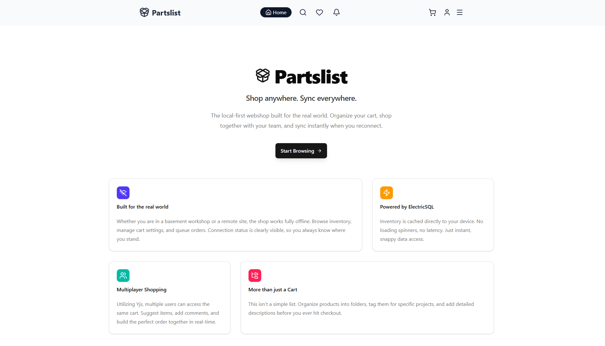
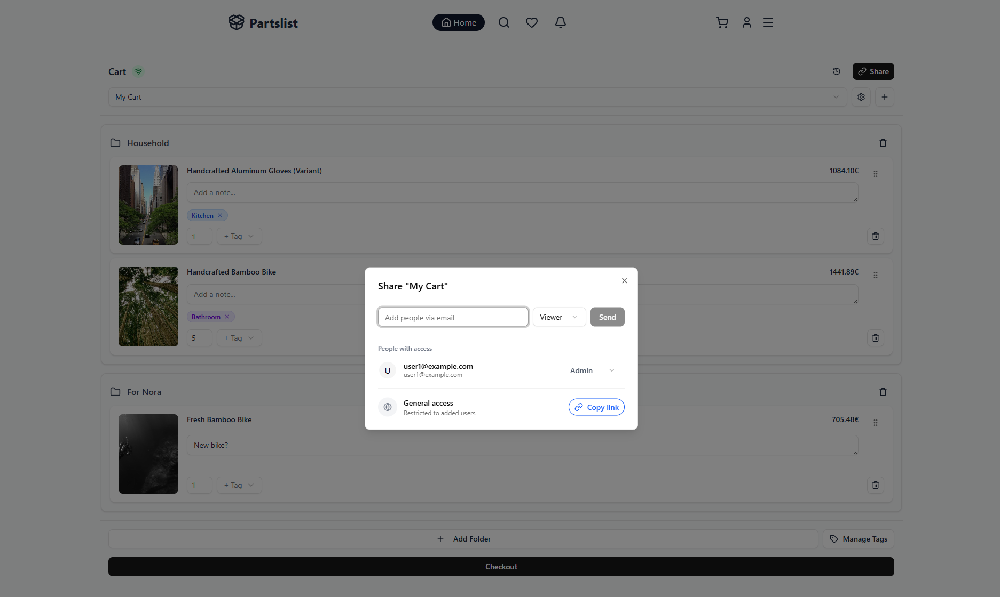
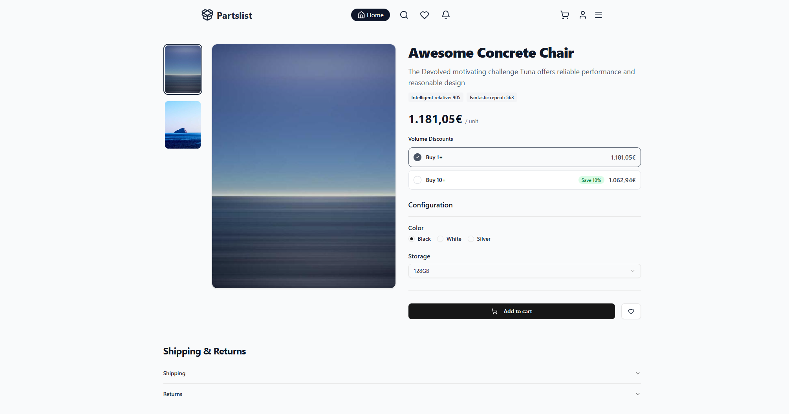
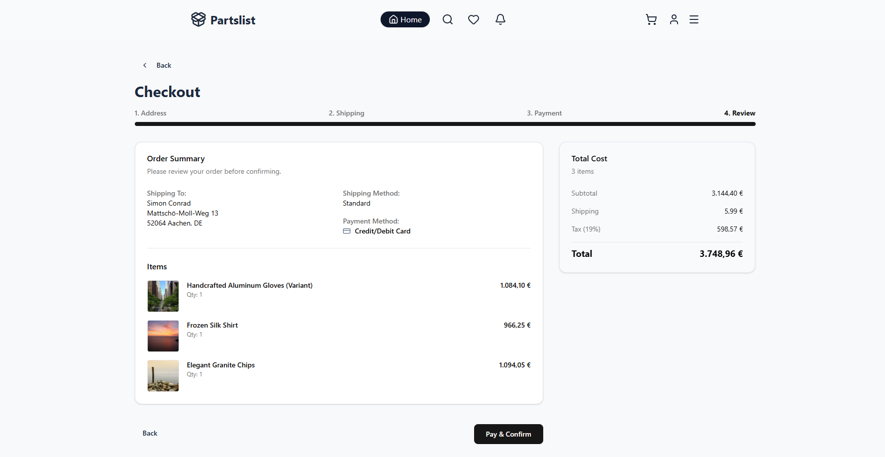
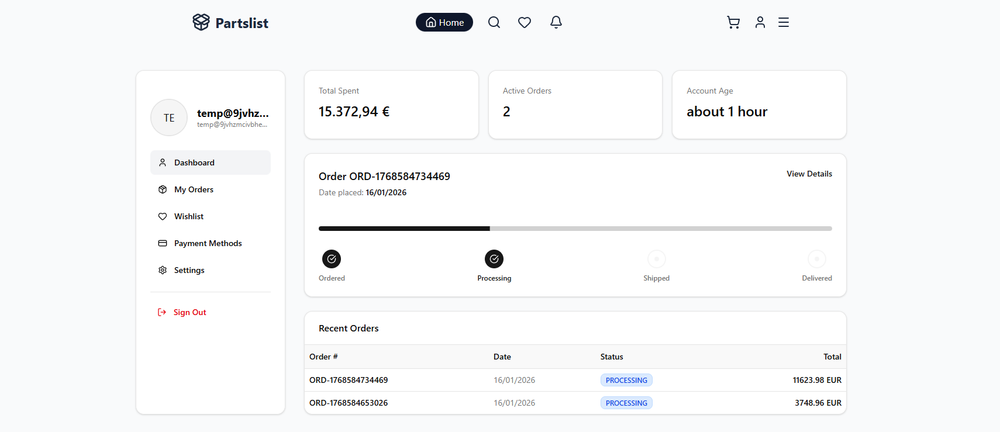
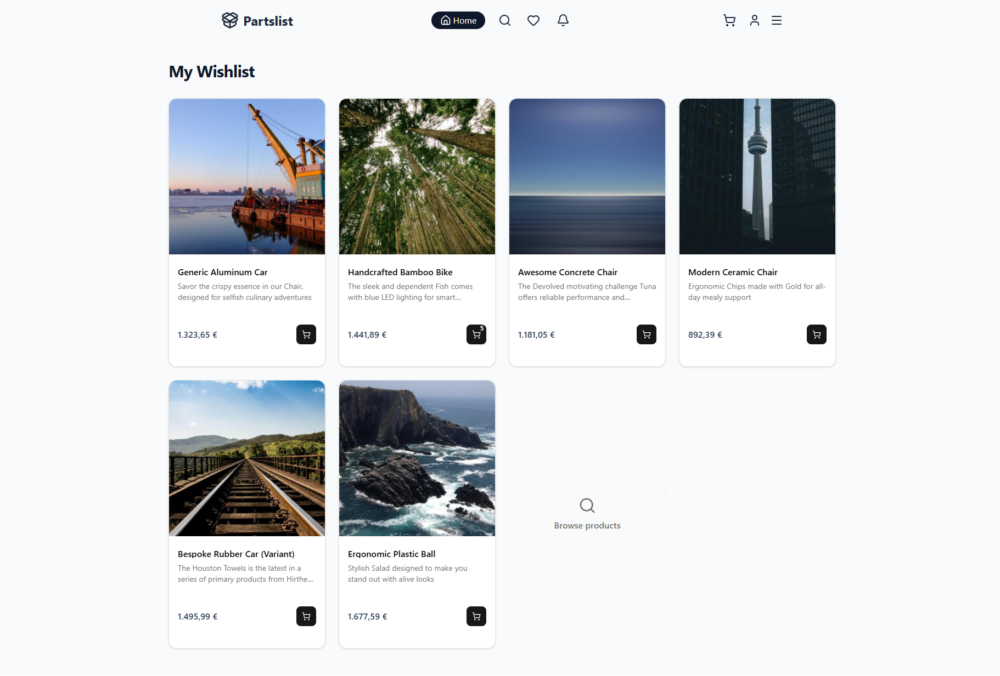

# UI Showcase: Partslist

This document summarizes the core functions of the webshop.

### 1. Architecture & Home

- **Offline-First:** The application is fully functional without an internet connection; changes sync automatically once a connection is re-established.
- **Performance:** No page reloading or latency, as the inventory is stored locally in the browser.
- **Collaboration:** Supports "Multiplayer Shopping," allowing multiple users to edit the same cart in real-time.

### 2. Catalog & Search

- **Client-Side Filtering:** Instant filtering by categories, manufacturers, and properties without server roundtrips.
- **Smart Asset Handling:**: Assets are lazily loaded to save on bandwidth. Blurhash alleviates the visual strain from image pop-in.

### 3. Cart Management & Collaboration

- **Advanced Organization:** The cart supports nested folder structures, tags, and custom notes per item.
- **Sharing & Permissions:** Users can invite others via email to view or edit the cart, assigning specific roles such as "Admin" or "Viewer."
- **Version Control:** A simple VSC system allows users to restore older versions of their cart in case of accidental changes.

### 4. Product Details

- **Volume Discounts:** Automatic price calculation based on quantity (e.g., 10% discount for 10+ units).
- **Dynamic Data:** Display of specific technical values ("Intelligent relative," "Fantastic repeat") based on Custom Fields.

### 5. Checkout

- **Cost Transparency:** Detailed breakdown of subtotal, shipping costs, and tax (19%).
- **Review:** Final summary of items and delivery details before purchase confirmation.
- **Payment Provider:** Payment processing implemented with Stripe for effective and accessible payments.

### 6. User Profile

- **Dashboard Metrics:** Display of total amount spent and number of active orders.
- **Order Tracking:** Visual status bar for current order progress (Ordered -> Processing -> Shipped -> Delivered).
- **History:** Tabular list of past orders including status and totals.

### 7. Wishlist

- **Saved Items:** Allows users to bookmark items for later purchases.
- **Quick Actions:** Items can be moved directly from the wishlist to the cart.
